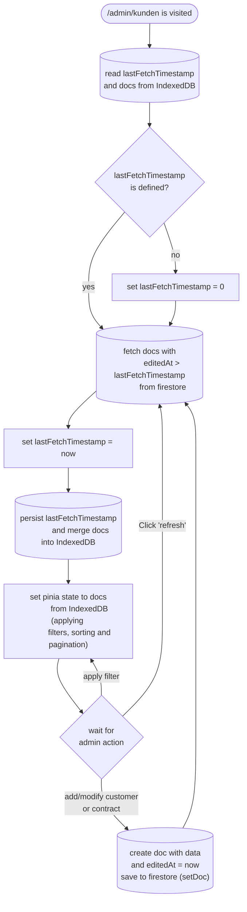

```mermaid
flowchart TD
  Start([/admin/kunden is visited])
  -->05[("""read lastFetchTimestamp
            and docs from IndexedDB""")]
  -->7{lastFetchTimestamp\n is defined?}
  7-- yes --> 20
  7-- no --> 10
  10["""set lastFetchTimestamp = 0"""]
  -->20[("""fetch docs with
            editedAt > lastFetchTimestamp
            from firestore""")]
  -->30[set lastFetchTimestamp = now] 
  -->35[("""persist lastFetchTimestamp
            and merge docs into IndexedDB""")]
  -->37["""set pinia state to docs
           from IndexedDB (applying 
           filters, sorting and pagination)"""]
  -->40{wait for\n admin action}
  40-- Click 'refresh' -->20
  40-- apply filter --> 37
  40-- add/modify customer\n or contract --> 
    60[("""create doc with data
           and editedAt = now
           save to firestore (setDoc)""")]-->20
%%  -->100(["finish"])
```
